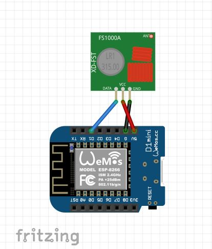
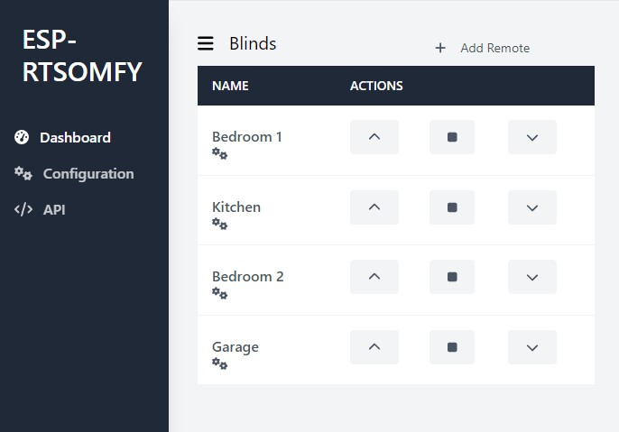

# SomfyController
Control Somfy blinds (with RTS Protocol) througt an Arduino Wemos D1.

It is based from the work of `Nickduino` at [Somfy_Remote](https://github.com/Nickduino/Somfy_Remote)

# Installation
## Required packages

To work, you need to install some libraries listed below:

- [Logger](https://github.com/bakercp/Logger)
- [Vector](https://github.com/janelia-arduino/Vector)
- [ESPAsyncWebServer](https://github.com/me-no-dev/ESPAsyncWebServer)
- [ESPAsyncTCP](https://github.com/me-no-dev/ESPAsyncTCP)
- [ArduinoJson](https://arduinojson.org/)

## Configuration

1. Rename the `default_config.h` file to `config.h`
2. Add or remove remotes by adding or removing elements from the list `SOMFY_CONFIG_REMOTES`.
3. To add a remote, simply add a string corresponding to the name of the remote.
4. To remove a remote, simply remove the string corresponding to the name of the remote.

## Soldering
Solder a 433.42 MHz crystals to replace the one on a 433.92MHz transmitter. A RTL-SDR comes in handy to check the frequency and make sure the transmitter is working.

## Wiring



## Upload to the arduino

Upload the project to the arduino.

---
# UI

The UI is built on top of ReactJS. A compiled version is already available in the [data directory](./data/).
If you need to add some feature, you can. All core application is defined in [ui directory](./ui/).



## Edit

- [Node.js](https://nodejs.org/en/) is required if you want to modify the UI.

Commands to start development server, build... are listed in the `README.md`.

## Upload the UI into the arduino.
To upload the UI into the arduino, you need to install `esp8266littlefs-plugin`

Documentation: [esp8266littlefs-plugin](https://github.com/earlephilhower/arduino-esp8266littlefs-plugin)

---
# API

Two routes are defined.

```bash
# Return JSON with all defined remotes.
curl ARDUINO_IP/remotes # GET
```

```bash
# Send a command.
# Actions are: up, down, stop, reset, prod, enable, disable
# Remote_id is the ID of the remote paired with the blind.
curl ARDUINO_IP/blind?action=[up, down, stop, prod, reset, enable, disable]&remote_id={remote_id} # GET
```

---
# Homebridge

You can link this project with Homebridge using the [homebridge-blinds](https://github.com/dxdc/homebridge-blinds#readme) plugin.


---
# Contributing
Pull requests are welcome. For major changes, please open an issue first to discuss what you would like to change.
